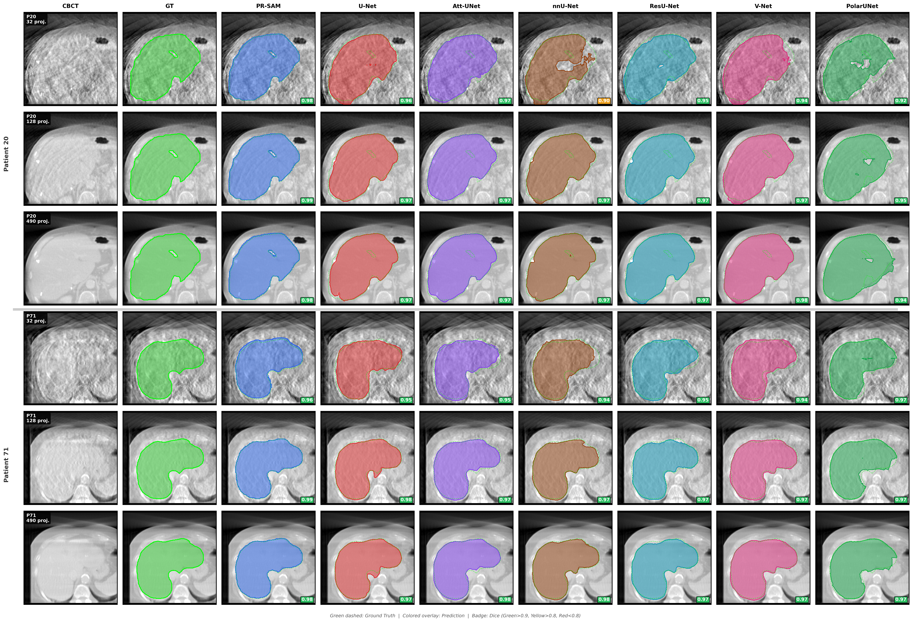
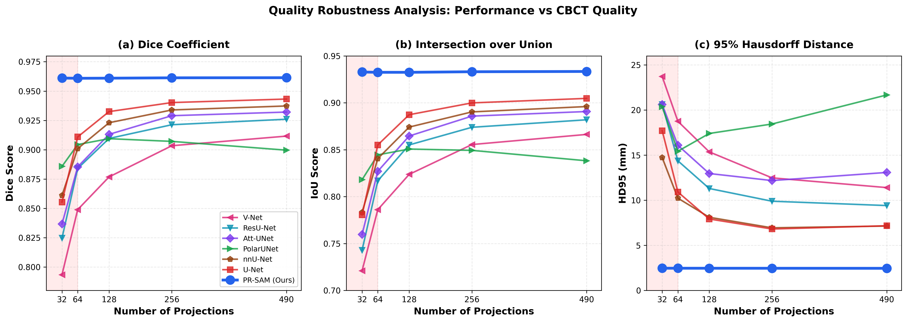

# PR-SAM: Patient-Specific Prior-Refined Prompting of a Frozen SAM for Quality-Robust CBCT Segmentation

[](https://www.python.org/downloads/)
[](https://pytorch.org/)
[](https://opensource.org/licenses/MIT)

Official implementation of **PR-SAM** (Prior-Refined SAM), a novel framework for quality-robust CBCT segmentation in online adaptive radiotherapy.

<p align="center">
  
</p>

## 📋 Abstract

Online adaptive radiotherapy (ART) requires fast, reliable segmentation of same-day CBCT despite artifacts that degrade image quality. We propose **PR-SAM**, a planning-CT guided approach that injects patient-specific anatomical priors into a frozen Segment Anything Model (SAM) to achieve robust CBCT segmentation without backbone fine-tuning.

**Key Results:**
- **Dice: 0.9611** | **HD95: 2.46 mm** (overall performance)
- **Quality-invariant**: Dice range 0.0005 across all quality tiers
- **+4.9% Dice** improvement over best baseline (U-Net)
- **-75.6% HD95** reduction compared to best baseline

<p align="center">
  
</p>

## 🏗️ Architecture

PR-SAM consists of four key components:

1. **Prior Encoder** (`N_prior`): Converts registered pCT masks into multi-channel representations (binary, signed-distance, boundary maps)
2. **Adaptive Correction Network** (`N_correct`): Learns feature-level residual refinement
3. **CBCT Domain Adapter**: Preserves domain-specific details from CBCT images
4. **Dual-Branch Decoding**: Combines prior-guided and correction branches for robust inference

```
                    ┌─────────────────────────────────────────────────────────┐
                    │                    PR-SAM Architecture                   │
                    └─────────────────────────────────────────────────────────┘
                    
    pCT Mask ──► Prior Encoder ──► Prior Features ──┬──► Prior Branch ──┐
                    (0.37M)              │          │                    │
                                         │          ▼                    │
                                         └──► Correction Network ──►─────┼──► Fusion ──► Output
                                              (1.84M)                    │
    CBCT ────► SAM Encoder ──► CBCT Features ──► CBCT Adapter ──────────┘
               (frozen 93.7M)                    (0.07M)
```

## 📁 Project Structure

```
PR-SAM/
├── models/
│   ├── proposed/
│   │   └── pgrsam/
│   │       ├── pgr_sam_model.py      # Main PR-SAM model
│   │       ├── pct_prior_encoder.py  # Prior encoder network
│   │       ├── correction_network.py # Adaptive correction network
│   │       └── ablation_models.py    # Ablation study variants
│   └── baselines/
│       ├── unet/                     # U-Net
│       ├── attention_unet/           # Attention U-Net
│       ├── nnunet/                   # nnU-Net
│       ├── resunet/                  # ResU-Net
│       ├── vnet/                     # V-Net
│       └── polar_unet/               # PolarUNet
├── data/
│   ├── dataset.py                    # Base dataset class
│   └── multi_quality_dataset.py      # Multi-quality CBCT dataset
├── configs/
│   ├── proposed_models.yaml          # PR-SAM configuration
│   ├── baseline_models.yaml          # Baseline configurations
│   └── ablation_study.yaml           # Ablation study configs
├── segment_anything_medsam/          # SAM backbone
├── utils/
│   ├── metrics.py                    # Evaluation metrics (Dice, IoU, HD95)
│   └── data_preprocessing.py         # Data preprocessing utilities
├── train_pgrsam.py                   # Training script for PR-SAM
├── train.py                          # Training script for baselines
├── evaluate_pgrsam.py                # Evaluation script
└── preprocess_dataset.py             # Data preprocessing
```

## 🚀 Quick Start

### Installation

```bash
# Clone the repository
git clone https://github.com/yourusername/PR-SAM.git
cd PR-SAM

# Create conda environment
conda create -n prsam python=3.9
conda activate prsam

# Install dependencies
pip install -r requirements.txt
```

### Download Pretrained Weights

Download the SAM ViT-B checkpoint:
```bash
mkdir checkpoints
wget https://dl.fbaipublicfiles.com/segment_anything/sam_vit_b_01ec64.pth -O checkpoints/sam_vit_b_01ec64.pth
```

### Data Preparation

1. Download the [LiTS dataset](https://competitions.codalab.org/competitions/17094)
2. Run preprocessing to generate multi-quality synthetic CBCT:

```bash
python preprocess_dataset.py --input_dir /path/to/LiTS --output_dir datasets/LiTS-preprocessed
```

This generates 5 CBCT quality tiers (Q32, Q64, Q128, Q256, Q490 projections).

### Training

**Train PR-SAM:**
```bash
python train_pgrsam.py --config configs/proposed_models.yaml
```

**Train Baselines:**
```bash
python train.py --model unet
python train.py --model attention_unet
python train.py --model nnunet
```

### Evaluation

```bash
python evaluate_pgrsam.py --checkpoint results/proposed/prsam/best_model.pth
```

## 📊 Results

### Quantitative Results (Test Set)

| Model | Dice ↑ | IoU ↑ | HD95 (mm) ↓ | Params |
|-------|--------|-------|-------------|--------|
| U-Net | 0.9165 | 0.8564 | 10.10 | 31.0M |
| Attention U-Net | 0.9092 | 0.8461 | 13.53 | 34.9M |
| nnU-Net | 0.8957 | 0.8284 | 11.14 | 31.2M |
| ResU-Net | 0.8871 | 0.8153 | 10.62 | 32.5M |
| V-Net | 0.9072 | 0.8446 | 8.04 | 45.6M |
| PolarUNet | 0.8658 | 0.7875 | 16.42 | 24.9M |
| **PR-SAM (Ours)** | **0.9611** | **0.9271** | **2.46** | **96.0M (2.3M trainable)** |

### Quality Robustness

| Quality | PR-SAM Dice | Best Baseline Dice | Improvement |
|---------|-------------|-------------------|-------------|
| Q32 (lowest) | 0.9611 | 0.8554 (U-Net) | +12.4% |
| Q64 | 0.9610 | 0.8863 (U-Net) | +8.4% |
| Q128 | 0.9609 | 0.9108 (U-Net) | +5.5% |
| Q256 | 0.9612 | 0.9258 (U-Net) | +3.8% |
| Q490 (highest) | 0.9614 | 0.9337 (V-Net) | +3.0% |

## 🔬 Ablation Study

| Configuration | Dice | HD95 (mm) |
|--------------|------|-----------|
| Full PR-SAM | 0.9611 | 2.46 |
| w/o Correction Network | 0.9528 | 3.21 |
| w/o Prior Encoder | 0.9445 | 4.15 |
| w/o CBCT Adapter | 0.9567 | 2.89 |
| Binary Prior Only | 0.9523 | 3.18 |
| Distance Prior Only | 0.9501 | 3.45 |

## 💻 Computational Efficiency

| Model | Trainable Params | Total Params | Inference Time |
|-------|-----------------|--------------|----------------|
| U-Net | 31.0M | 31.0M | 12 ms |
| PR-SAM | 2.28M (2.4%) | 96.0M | 42 ms |

## 📝 Citation

If you find this work useful, please cite:

```bibtex
@article{prsam2024,
  title={PR-SAM: Patient-Specific Prior-Refined Prompting of a Frozen SAM for Quality-Robust CBCT Segmentation in Online Adaptive Radiotherapy},
  author={},
  journal={IEEE Journal of Biomedical and Health Informatics},
  year={2024}
}
```

## 📄 License

This project is licensed under the MIT License - see the [LICENSE](LICENSE) file for details.

## 🙏 Acknowledgments

- [Segment Anything Model (SAM)](https://github.com/facebookresearch/segment-anything) by Meta AI
- [LiTS Dataset](https://competitions.codalab.org/competitions/17094) for liver tumor segmentation benchmark
- PyTorch and the open-source community

## 📧 Contact

For questions or collaborations, please open an issue or contact [your-email@example.com].

